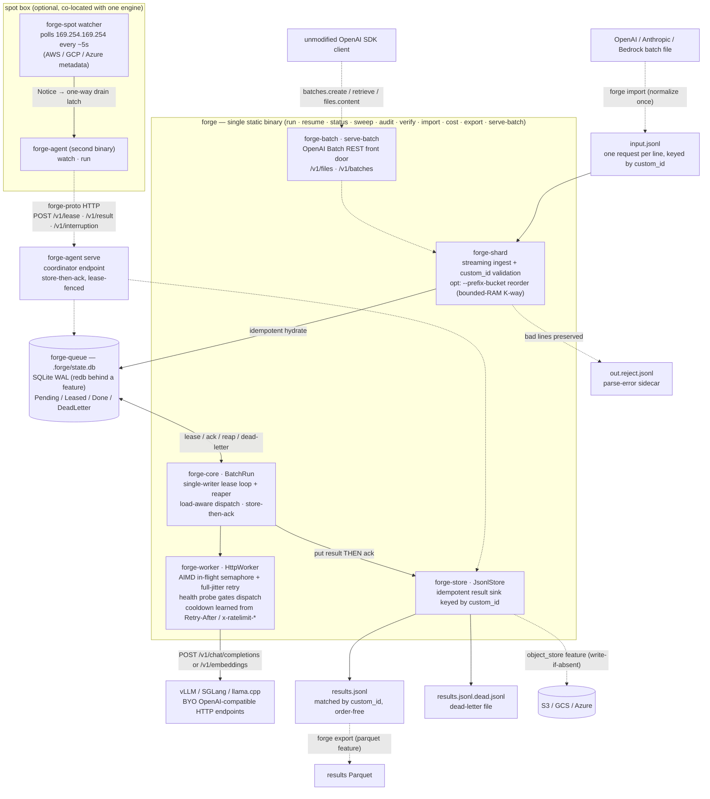
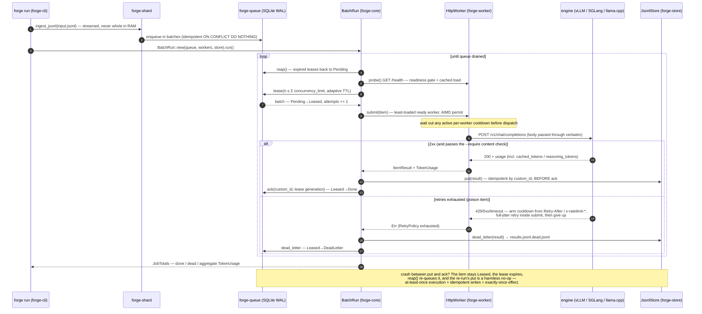

# forge — design & event flow

How forge works, exactly as built: the component map, the end-to-end event flow,
the state machine that makes crash/spot recovery structural, and the properties
this design buys that neither closed cloud Batch APIs nor DIY control-plane glue
currently offer. Flags and knobs live in [CONFIG.md](./CONFIG.md), wire contracts
in [API.md](./API.md), operational practice in [OPERATIONS.md](./OPERATIONS.md),
and the measured proofs in [BENCHMARKS.md](../BENCHMARKS.md).

## 1. The problem shape

Offline batch inference is ~5–10× cheaper per token than online serving (higher
GPU utilization), and spot capacity cuts another 60–90% off on-demand pricing —
but capturing both savings today means either:

- **a closed cloud Batch API**: a flat ~50% discount, a 24-hour window you can't
  see inside ("stuck at 0/N in progress"), no choice of model weights, no
  partial results, and results only at the end; or
- **DIY glue**: a heavyweight cluster framework stapled to your inference
  engines, plus hand-rolled checkpointing, retry logic, and spot-interruption
  babysitting — a distributed-systems project bolted onto what is conceptually
  "run this JSONL against these endpoints".

forge is the missing middle: a **single ~4 MB static binary** that does *only*
the orchestration shell — durable work queue, streaming ingest, lease/retry/
checkpoint, spot-drain, backpressure, result aggregation, cost accounting —
while the GPU heavy-lifting stays in the engines (vLLM / SGLang / llama.cpp or
anything OpenAI-compatible) where it belongs.

## 2. Design invariants

Everything below is enforced in the type system or CI, not by convention:

1. **Single homogeneous fan-out.** One job = one flat set of independent items.
   There is no `depends_on`, no fan-in, no successor edge, no topological sort
   anywhere in `forge-core` — arbitrary task graphs are
   [dagron](https://github.com/lucheeseng827/dagron)'s job, and a CI doctrine
   guard keeps it that way.
2. **Single-writer coordinator.** Exactly one process owns the queue; workers
   and agents only *propose* results, fenced by lease generation. No consensus
   protocol, no distributed lock service.
3. **At-least-once execution + idempotent writes = exactly-once *effect*.**
   Never exactly-once execution (that's a lie on top of HTTP); instead every
   result write is keyed by `custom_id`, so a re-execution's write is a no-op.
4. **The checkpoint is not an artifact.** It is the union of state that already
   has to exist: queue rows + the input byte-offset index + the emitted-id
   manifest. There is no snapshot to schedule, corrupt, or forget.
5. **The lean binary stays lean.** Cloud SDKs (`object_store`), the Arrow stack
   (`parquet`), and the rate limiter (`governor`) are off-by-default features;
   CI asserts they are absent from the default build.
6. **BYO everything.** Engines, capacity, and credentials are yours; forge never
   launches, tears down, or autoscales instances — provisioning belongs to your
   provisioner/operator.

## 3. Component map

Solid arrows are the hot path inside the single `forge` binary; dashed arrows
are the optional pieces (the co-located spot agent and the feature-gated result
backends).



The crate split *is* the dependency story: `forge-core` is the leaf (types,
the `Queue` / `Worker` / `ResultStore` traits, the fan-out loop) and every other
crate is an interchangeable driver behind those traits — the same loop runs over
SQLite + HTTP + JSONL today and other backends tomorrow, with zero `dyn`
dispatch.

## 4. Event flow — `forge run` end to end

The load-bearing ordering is step 12: the result is checkpointed to the store
**before** the queue ack. That single ordering decision is what turns
at-least-once execution into an exactly-once *effect* (§5).



Two flows sit on top of the same loop:

- **Resume** (`forge resume`): reopen the queue file, expire stale leases, seed
  the store's emitted-id set from the existing output, and run the identical
  loop. Nothing is special-cased; a resumed run *is* a run.
- **Batch REST** (`forge serve-batch`): `/v1/files` upload lands the input
  JSONL, `batches.create` is a job submit, batch status maps **live queue
  counts** (real per-item progress), and result retrieval streams output lines
  — retrievable **mid-run**, not only at completion.

## 5. The item state machine — delivery semantics

```text
                 lease txn (single writer)
   ┌─────────┐  leased_until=now+T, attempts+=1   ┌─────────┐
   │ Pending │ ─────────────────────────────────▶ │ Leased  │
   └─────────┘                                     └────┬────┘
        ▲                                               │
        │ reaper: leased_until < now                    │ result write to store SUCCEEDS
        │ (worker died / spot-killed / restart)         │ THEN ack
        │  ◀────────────────────────────────────────────┤
        │                                               ▼
        │                                          ┌─────────┐
        │                                          │  Done   │
        │                                          └─────────┘
        │ attempts ≥ max_attempts                  ┌──────────────┐
        └─────────────────────────────────────────│ DeadLetter   │
                          retry exhausted          └──────────────┘
```

| Transition | Trigger | Guarantee |
|---|---|---|
| `Pending → Leased` | The coordinator's single-writer lease txn sets `leased_until = now+T`, `attempts += 1`. | Bounded outstanding work = Σ `concurrency_limit`. |
| `Leased → Done` | **Only after** the idempotent result write succeeds, then ack — fenced by lease generation, so a stale worker can never close a re-leased item. | Exactly-once *effect*: a crash between inference and ack leaves the item `Leased`; the lease expires, it re-runs, and the second write is a no-op. |
| `Leased → Pending` | Reaper finds `leased_until < now` (worker died, spot-killed, coordinator restarted). | Loss bounded to the in-flight width — at most the items leased to the dead worker, and zero already-stored results. |
| `Leased → DeadLetter` | `attempts ≥ max_attempts` after full-jitter backoff on 429/5xx/timeout. | A poison item quarantines to the dead-letter file; one bad prompt can never wedge the job. |

Honest caveat, stated rather than hidden: non-deterministic sampling
(`temperature > 0`, no seed) means a re-executed item may produce a *different*
output. forge guarantees every id gets exactly one terminal result — pin seeds
if you need bit-reproducible resume.

**Spot interruption is the same machine, entered politely.** The optional
co-located `forge-agent` runs the `forge-spot` metadata watcher in the VM; an
interruption notice flips a one-way **drain latch** — stop pulling new leases,
let in-flight items finish if the ~30s window allows, leave the rest `Leased`
for lease-expiry re-queue. There is deliberately **no** "flush a big batch on
notice" path: it cannot survive the window, so the design never depends on it.
A missed notice degrades to the crash path above, which is already zero-loss
for stored results.

## 6. The backpressure stack

Five mechanisms compose, each answering a different question:

| Layer | Question it answers | Mechanism |
|---|---|---|
| Per-worker semaphore | "How many requests may be in flight *here*?" | Hard cap = the engine's own declared limit (`--max-num-seqs` etc.). |
| AIMD (always on) | "What is this endpoint's *real* ceiling right now?" | +1 permit per 8 clean 2xx toward the cap; halve on 429/5xx/connection error, the cut paid lazily as permits return. |
| Header cooldown (always on) | "What did the endpoint *tell* us to do?" | `Retry-After` / exhausted `x-ratelimit-*` budgets arm a shared per-worker cooldown, waited out at `submit()` entry so the whole fleet backs off in lockstep. Clamped to 120 s. |
| `governor` (opt-in feature) | "What rate ceiling did the *operator* promise?" | Global GCRA req/s cap per worker — concurrency and rate are different axes. |
| Load-aware dispatch + `--prefix-bucket` | "Which ready worker, and in what order?" | Bias toward the least-loaded engine (read from its own queue-depth metric, degrading to round-robin); optionally reorder input by `(model, system-prompt)` so the engine's automatic prefix cache stays hot and the hits come back as `cached_tokens`. |

## 7. What this design offers that alternatives don't

Capability-by-capability, all of it verifiable in this repo:

- **A single static binary is the whole deployment.** ~4 MB, no Python, no
  cluster runtime, no DB server, no container required. `scp` + run.
- **Kill -9 is a tested path, not an apology.** The measured
  crash → `resume` → zero-loss proof is in [BENCHMARKS.md](../BENCHMARKS.md):
  every id done exactly once, no input⨝output join needed afterward.
- **Resume-readiness is queryable.** `forge audit` reports pending / live-lease
  / orphaned-lease / done / dead and what a resume would reclaim — the answer
  batch operators otherwise reconstruct by hand-joining input against output.
- **Real per-item progress and mid-run partials.** Batch status is live queue
  counts, and results stream out while the run is still going — against a
  closed batch window you get neither.
- **The OpenAI Batch REST contract over your own GPUs.** Unmodified OpenAI SDK
  code (`batches.create` / `retrieve` / `files.content`) runs against
  `forge serve-batch` — with your model weights, your spot economics, and no
  fixed completion window.
- **Exact cost accounting, never estimates.** Every item's real `usage` is
  captured (including `cached_tokens` and `reasoning_tokens`); `forge cost`
  turns it into $/Mtok, tokens-per-dollar, and savings vs a named online
  baseline — and goes honestly negative when a small job doesn't amortize the
  fleet.
- **Completeness you can prove.** `forge verify` shows every input id reached a
  terminal state, at 50M-id scale in bounded RAM, via an exact external
  sort-merge — not a probabilistic filter that can silently vouch for a
  missing id.
- **An endpoint's real throughput is discovered, not tuned.** AIMD + header
  cooldown + load-aware dispatch converge on each engine's actual ceiling; the
  alternative is days of hand-tuning a batch script per fleet shape.
- **Off-ramp included.** `forge import` normalizes OpenAI / Anthropic / Bedrock
  batch files, so leaving a closed batch API is a file copy, not a rewrite.

## 8. Non-goals

Refusals are load-bearing; each keeps the core simple enough to trust:

| Not this | Why not | Where it belongs |
|---|---|---|
| Task graphs, `depends_on`, fan-in, cron | The moment items relate, you need a scheduler — a different product with different failure modes. | [dagron](https://github.com/lucheeseng827/dagron) |
| Provisioning / autoscaling | forge consumes interruption signals and re-queues; acquiring capacity is a solved, separate problem. | your provisioner / operator |
| Running inference in-process | Engines already do continuous batching better than any coordinator could. | vLLM / SGLang / llama.cpp |
| Exactly-once execution | Impossible over HTTP without engine cooperation; claiming it would be dishonest. | exactly-once *effect* via idempotent writes (§5) |
| Wire-level request batching | The engine's continuous batching packs concurrent requests; batching again on the wire only adds latency. | the engine |
